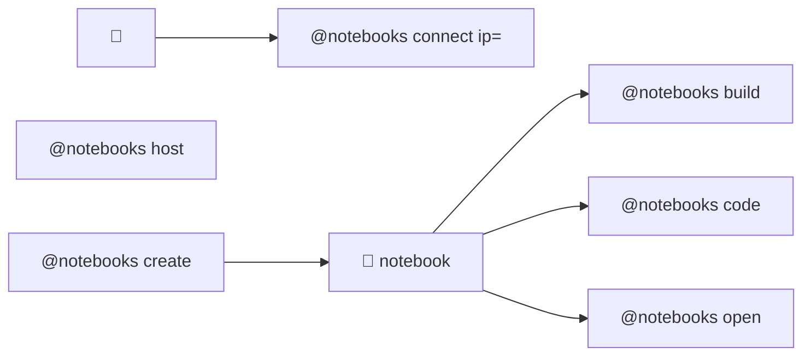

# 🌀 bluer-sandbox

🌀 A sandbox for ideas and experiments.

```bash
pip install bluer-sandbox
```



items:::

---

> 🌀 [`blue-sandbox`](https://github.com/kamangir/blue-sandbox) for the [Global South](https://github.com/kamangir/bluer-south).

---

signature:::