# 🌀 bluer-sandbox

🌀 A sandbox for ideas and experiments.

## installation

```bash
pip install bluer-sandbox
```

## aliases

[@assets](./bluer_sandbox/docs/aliases/assets.md), 
[@docker](./bluer_sandbox/docs/aliases/docker.md), 
[@notebooks](./bluer_sandbox/docs/aliases/notebooks.md), 
[@offline_llm](./bluer_sandbox/docs/aliases/offline_llm.md).

```mermaid
graph LR

    assets_publish["@assets publish extensions=png+txt,push <object-name>"]

    notebooks_build["@notebooks build <notebook-name>"]

    notebooks_code["@notebooks code <notebook-name>"]
    
    notebooks_connect["@notebooks connect ip=<ip-address>"]

    notebooks_create["@notebooks create <notebook-name>"]

    notebooks_host["@notebooks host"]

    notebooks_open["@notebooks open <notebook-name>"]

    offline_llm_install["@offline_llm install"]

    offline_llm_prompt["@offline_llm prompt~~- <prompt> <object-name>"]

    object["📂 object"]:::folder
    prompt["🗣️ prompt"]:::folder
    notebook["📘 notebook"]:::folder
    ip_address["🛜 <ip-address>"]:::folder

    notebook --> notebooks_build

    notebook --> notebooks_code

    ip_address --> notebooks_connect

    notebooks_host --> ip_address

    notebooks_create --> notebook

    notebook --> notebooks_open

    prompt --> offline_llm_prompt
    offline_llm_prompt --> object

    object --> assets_publish
```



items:::

---

> 🌀 [`blue-sandbox`](https://github.com/kamangir/blue-sandbox) for the [Global South](https://github.com/kamangir/bluer-south).

---

signature:::