# 🌀 bluer-sandbox

🌀 A sandbox for ideas and experiments.

```bash
pip install bluer-sandbox
```

```mermaid
graph LR

    notebooks_build["@notebooks build <notebook-name>"]

    notebooks_code["@notebooks code <notebook-name>"]
    
    notebooks_connect["@notebooks connect ip=<ip-address>"]

    notebooks_create["@notebooks create <notebook-name>"]

    notebooks_host["@notebooks host"]

    notebooks_open["@notebooks open <notebook-name>"]

    notebook["📘 notebook"]:::folder
    ip_address["🛜 <ip-address>"]:::folder

    notebook --> notebooks_build

    notebook --> notebooks_code

    ip_address --> notebooks_connect

    notebooks_host

    notebooks_create --> notebook

    notebook --> notebooks_open
```



items:::

---

> 🌀 [`blue-sandbox`](https://github.com/kamangir/blue-sandbox) for the [Global South](https://github.com/kamangir/bluer-south).

---

signature:::